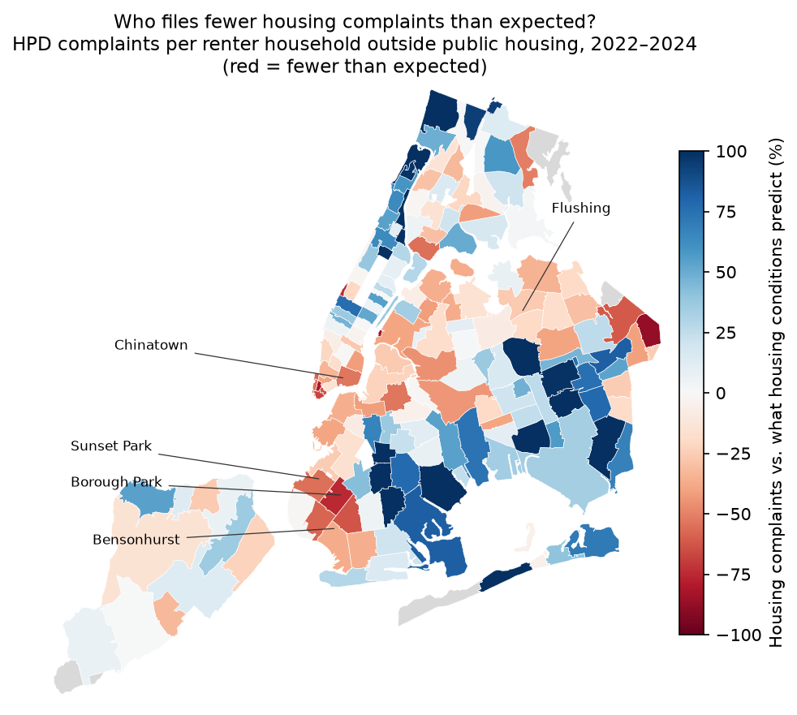

# NYC 311 Civic Analytics and Complaint Forecasting

**Live dashboard: https://nyc-311-civic-analytics.streamlit.app** —
updates itself monthly as new city data arrives and forecasts are
scored. (Free hosting sleeps when idle; if you see a wake-up button,
it takes about 30 seconds.)

> I turned a classroom visualization assignment into a reproducible
> civic analytics and forecasting pipeline that processes more than
> 22.6 million NYC 311 records and evaluates predictions honestly as
> new city data arrives.

End-to-end civic analytics project analyzing NYC 311 service requests
(2020–present): exploratory analysis, population-adjusted borough
comparisons, monthly complaint-volume forecasting with honest
baseline comparisons, and an analysis of which neighborhoods file
fewer housing complaints than their housing conditions predict —
presented through a Streamlit dashboard.

Every number below traces to a file in this repo — a model comparison
table, a frozen forecast in `data/forecasts/`, the live scoreboard in
`data/live/`, or a script's output in `data/processed/anomaly_findings/`
or `data/equity/results/`. None of it was hand-typed from a terminal
scrollback.

## The short version

- **Raw totals can fool you.** Brooklyn files the most 311 complaints
  because it has the most people. Per resident, the Bronx files the
  most: about a third more than Brooklyn.
- **2026 is on track to be the busiest year since at least 2020:**
  January–September brought about 300,000 more complaints than the
  same months of 2025. The biggest spikes line up with specific
  events. Snow complaints rose nearly 11-fold during a February
  blizzard, street complaints like potholes quadrupled in March, and
  illegal-parking complaints in Brooklyn and Queens keep rising year
  after year.
- **The forecasts are graded honestly.** Each prediction is locked in
  before the real numbers exist, then scored automatically when they
  arrive. In the first three months (July–September 2026), the
  machine-learning model beat the simple "same as last year" guess
  (off by about 5% vs. 7%). Both guessed too low in a year this busy.
- **Some neighborhoods are quieter than their problems.**
  Neighborhoods with more Chinese-speaking families who have limited
  English file noticeably fewer housing complaints than their
  buildings' conditions would predict. Chinatown files about half as
  many as expected.
- **The big lesson:** a complaint count shows who speaks up, not just
  where the problems are. A city that sent help based on complaints
  alone would shortchange the people who face the most barriers to
  complaining.

*These are patterns in the data, not proof of what causes them. The
sections below show how each was tested and where it could be wrong.*

## Motivation

This project began as an EST 389 (Intro to Responsible AI and Data
Science) class assignment: clean and visualize one year of NYC 311
complaint data. I originally picked NYC 311 because the dataset was
large and I wanted real experience working with public data at scale.
I later expanded it into a full pipeline covering more than 22.6
million records from January 2020 through September 2026 (22,659,637;
`data/live/metadata.json` holds the current total, which grows each
month).

It's also personally motivated. I regularly notice sanitation issues
in my own neighborhood — trash left on the street that doesn't get
picked up — and I once witnessed a robbery involving Chinese elders
in broad daylight in Chinatown. Experiences like that made me think
about how public data, reporting systems, and policy decisions affect
the safety and quality of life of New Yorkers, and about who gets
heard by those systems and who doesn't.

I was also encouraged by seeing city leadership use complaint data to
respond to visible issues like potholes — proof that public data
drives real action when agencies interpret and act on it well. I hope
projects like this can surface insights that support better policy
and help make New York City a better place.

### Why civic analytics

I care about improving NYC and was curious what was hidden inside
millions of 311 complaints. Specifically, I wanted to understand:

- what residents actually report
- how complaints vary across boroughs
- which issues follow seasonal patterns
- how raw totals can create misleading impressions
- whether historical data can forecast future complaint volume

## Project evolution

- **EST 389 (class project).** One year of 311 data, exploratory
  analysis and visualization, in `notebooks/` and `report/` (not yet
  restored to this repo — see Repository structure below).
- **Portfolio expansion.** The same question asked at real scale:
  2020–present, 22.6M+ records, a memory-safe DuckDB/Parquet
  pipeline, population-adjusted comparisons, baseline-vs-ML
  forecasting, frozen predictions scored against real incoming data,
  and a Streamlit dashboard.
- **What stayed the same.** The core question — what do 311 complaints
  actually tell you, and what do they not — is the same question the
  class project asked. The scale and rigor changed; the concern about
  reporting bias didn't.

## Key design decisions

- **DuckDB for the 14 GB raw CSV (about 21.9M rows from 2020 on).** The raw export is
  converted once to yearly Parquet partitions in a single streaming
  pass. No pandas chunking, no memory pressure, and the raw CSV is
  never read again.
- **Incremental updates via the Socrata API.** Only records newer than
  the local maximum date are ever downloaded.
- **Automated monthly forecasting.** A GitHub Action pulls complete-month
  aggregates straight from the API (no raw data needed), scores every
  frozen forecast, freezes the next ones, and commits the results — so
  the forecast track record builds itself, publicly, in git history.
- **Baselines before models — and the result is honestly mixed.**
  On the 2025 validation split, the seasonal-naive baseline
  (same month, one year prior) beats both trained models on every
  metric (see Model performance below). But on the six complete 2026
  test months — which cover the structural break described below —
  both trained models beat the seasonal-naive baseline by a wide
  margin, because the baseline has no way to see a regime change and
  the trained models can partially adapt via recent lags. Neither
  fact is hidden in favor of the other.
- **Frozen forecasts.** Predictions are timestamped and never
  overwritten, so forecast accuracy against incoming 2026 actuals is
  measured without hindsight bias. Two bugs were found and fixed in
  this frozen-forecast machinery — see "Frozen forecasts" below.
- **Record-level findings are scripted, not typed.** Every anomaly
  number (complaint-type deltas, channel shifts, ZIP concentration)
  comes from `src/anomaly_analysis.py`, which reads the raw Parquet
  partitions directly and writes its results to
  `data/processed/anomaly_findings/`. Anyone cloning this repo can
  regenerate every figure in the anomaly section below.
- **Reporting bias is documented, not ignored.** 311 data measures who
  reports, not where conditions are worst — see Data responsibility.

## Setup (macOS)

```bash
git clone <your-repo-url>
cd nyc-311-civic-analytics

python3 -m venv .venv
source .venv/bin/activate
pip install -r requirements.txt
```

Edit `config/settings.py` and set `RAW_CSV_PATH` to wherever your
downloaded 311 CSV lives (keep it outside the repo).

## Run order

```bash
python src/inspect_csv.py              # 1. look at the columns first
python src/convert_csv_to_parquet.py   # 2. one-pass CSV -> Parquet (do once)
python src/build_monthly_counts.py     # 3. small aggregate tables
python src/per_capita_analysis.py      # 4. population-adjusted comparison
python src/build_forecast_dataset.py   # 5. lag/rolling feature table
python src/train_evaluate.py           # 6. baselines vs models
python src/forecast_2026.py            # 7. freeze a 3-month GB forecast
python src/forecast_seasonal_naive.py  # 8. freeze a 3-month seasonal-naive forecast
python src/anomaly_analysis.py         # 9. record-level findings behind the 2026 break
python src/fetch_reporting_gap_data.py # 10. 311 + Census + NYCHA + boundaries -> data/equity/ (one-time, ~1 min)
python src/reporting_gap_analysis.py   # 11. who files fewer complaints than housing predicts
streamlit run dashboard/app.py         # 12. dashboard
```

Monthly refresh runs automatically (see "Live, automated forecasting"
below). To run the same steps by hand, with no raw data needed:

```bash
python src/refresh_live.py             # complete-month aggregates from the API -> data/live/
python src/score_forecasts.py          # score every frozen forecast -> data/live/forecast_scoreboard.csv
python src/build_forecast_dataset.py   # then retrain and freeze the next forecasts
python src/train_evaluate.py
python src/forecast_2026.py
python src/forecast_seasonal_naive.py
```

To refresh the local record-level data instead (needed for
`anomaly_analysis.py`):

```bash
python src/update_from_api.py          # fetch only new raw records
python src/build_monthly_counts.py     # rebuild local aggregates
```

## Repository structure

```
.github/workflows/          monthly refresh, scoring, and forecast freezing
config/                     paths and constants
data/raw/                   yearly Parquet partitions (gitignored)
data/processed/             small aggregate tables (gitignored)
data/processed/anomaly_findings/  record-level findings, output of anomaly_analysis.py (gitignored)
data/live/                  API aggregates + forecast scoreboard, refreshed monthly (tracked in git)
data/forecasts/             frozen, timestamped forecast files (tracked in git)
data/forecasts/superseded.csv  which frozen files are excluded from scoring, and why
data/equity/                311 + Census + NYCHA inputs and neighborhood boundaries (tracked in git)
data/equity/results/        reporting-gap results and robustness checks (tracked in git)
data/borough_population.csv 2020 Census borough populations (tracked in git)
src/                        pipeline scripts, numbered by run order above
dashboard/                  Streamlit app
notebooks/                  currently empty — original EST 389 notebook not yet
                             recovered from prior machine
report/                     currently empty — EST 389 final report not yet
                             recovered from prior machine
```

## Data source

NYC Open Data, 311 Service Requests (asset `erm2-nwe9`):
https://data.cityofnewyork.us/Social-Services/311-Service-Requests-from-2010-to-Present/erm2-nwe9

Borough populations from the 2020 US Census, in
`data/borough_population.csv`:

| Borough | Population |
|---|---|
| Brooklyn | 2,736,074 |
| Queens | 2,405,464 |
| Manhattan | 1,694,251 |
| Bronx | 1,472,654 |
| Staten Island | 495,747 |

## Population normalization: the equity flip

Source: `data/live/borough_per_capita.csv` (refreshed monthly by
`src/refresh_live.py`; figures below are complete months, January
2020–September 2026). `src/per_capita_analysis.py` builds the same
table from the local raw snapshot.

My original class analysis showed Brooklyn with the highest total
complaint count — unsurprising, since Brooklyn is also the most
populous borough:

| Borough | Total complaints (Jan 2020–Sep 2026) | Population | Complaints per 100k |
|---|---|---|---|
| Brooklyn | 6,800,549 | 2,736,074 | 248,551 |
| Queens | 5,452,251 | 2,405,464 | 226,661 |
| Bronx | 4,816,169 | 1,472,654 | **327,040** |
| Manhattan | 4,559,278 | 1,694,251 | 269,103 |
| Staten Island | 952,040 | 495,747 | 192,042 |

Adjusted for population, the ranking flips: the **Bronx** has the
highest complaint rate per 100,000 residents, despite having the
second-smallest population and only the third-highest raw total of
the five boroughs. Raw totals mostly track population size;
per-capita rates surface a different pattern entirely.

This normalization still has limits — complaint locations can involve
commuters, tourists, and people reporting problems outside the
borough where they live, and it says nothing about *why* the Bronx
rate is higher (see Data responsibility below).

## Machine learning, in plain English

Four methods are compared, from simplest to most complex:

- **Previous-month baseline.** Predicts next month by copying the
  most recent completed month. If June had 330,000 complaints, it
  predicts July will too. Reacts fast to recent shifts, but ignores
  yearly seasonality entirely.
- **Seasonal lag-12 baseline.** Predicts a month using the same month
  from the previous year — July 2026 is predicted from July 2025.
  Works well when the year-over-year pattern repeats: heating
  complaints rise every winter, noise complaints rise every summer.
- **Linear regression.** Fits a weighted equation linking the target
  to engineered features (recent lags, rolling averages, month
  encodings). Simple and easy to explain, e.g. "higher recent volume
  predicts higher next-month volume" — but it can't easily represent
  sudden or nonlinear shifts.
- **Gradient boosting.** Builds a sequence of small decision trees,
  each one correcting the errors of the trees before it. Can capture
  interactions a linear model can't — e.g. "a winter month with a
  given recent-count level behaves differently than a summer month at
  the same level" — but with only ~60–70 monthly observations to
  train on, it has more room to overfit than the simpler methods.

### Model performance

Source: `data/processed/model_comparison.csv` (validation, 2025) and
`data/processed/model_comparison_test_2026.csv` (test, six complete
months of 2026: Jan–Jun), as produced by the July 22, 2026 run.
`train_evaluate.py`'s test set grows as months complete, so re-running
it later extends the test window past June.

**Validation (2025) — a baseline wins:**

| model | MAE | RMSE | MAPE | WAPE |
|---|---|---|---|---|
| baseline_seasonal_lag12 | 17,203 | 22,959 | 5.44% | 5.65% |
| gradient_boosting | 19,704 | 25,331 | 6.25% | 6.47% |
| linear_regression | 22,294 | 27,713 | 7.19% | 7.32% |
| baseline_previous_month | 25,911 | 34,513 | 8.82% | 8.51% |

2025 followed stable, repeating seasonal patterns, so copying the
matching month from 2024 was hard to beat.

**Test (2026 Jan–Jun) — the trained models win instead:**

| model | MAE | RMSE | MAPE | WAPE |
|---|---|---|---|---|
| linear_regression | 24,948 | 26,891 | 7.43% | 7.50% |
| gradient_boosting | 25,630 | 31,660 | 7.55% | 7.71% |
| baseline_seasonal_lag12 | 39,295 | 46,693 | 11.84% | 11.82% |

Early 2026 did not follow 2025 as closely — snow, street-condition,
illegal-parking, and reporting-channel changes (see below) pushed
volume above the prior year. The seasonal baseline could only repeat
last year's number; the trained models could partially react because
they see recent lags and rolling averages. That reversal — not a
flat "ML wins" — is the actual finding.

**What these models predict.** All four predict how many complaints
will be *recorded* by NYC 311 — not actual crime, not actual
neighborhood safety, not actual infrastructure quality, and not how
many problems truly exist. Reporting depends on awareness, language
access, technology access, and trust in government, on top of
whatever is actually happening on the ground (see Data responsibility).

## Frozen forecasts

`data/forecasts/` holds every forecast ever generated, never
overwritten. Two generation bugs were found and fixed here rather
than hidden — a debugging lesson worth keeping visible rather than
quietly patched:

- **Gradient boosting v1/v2 → v3 — partial-month contamination.**
  `forecast_2026_gradient_boosting_20260722_1857.csv` and
  `..._1916.csv` are byte-identical in their predictions — only the
  timestamp changed between them. Both claimed
  `training_end_month = 2026-07`, but `forecast_2026.py` read
  `monthly_citywide_counts.parquet` directly, bypassing the
  incomplete-month guard that `build_forecast_dataset.py` applies to
  training data. July 2026 had 226,542 rows at generation time — about
  70% of a normal month, since the snapshot only covered dates through
  July 21 — so both files' `lag_1` was anchored on an artificially low
  partial month, which then propagated into every subsequent
  recursive prediction. `forecast_2026.py` now applies the same
  guard. `..._2058.csv` is the corrected version:
  `training_end_month = 2026-06`, forecasting July onward instead of
  August onward. v1 and v2 are kept, not deleted, per the
  frozen-forecast policy — they are superseded for anchor
  contamination, not erased.
- **Seasonal-naive baseline was lag-24, not lag-12.**
  `forecast_2026_seasonal_naive_20260722_baseline.csv` has no
  generating script in `src/` and its six predictions turn out to
  match **2024**'s monthly values exactly (verified against
  `monthly_citywide_counts.parquet`) — two years back, not "same
  month last year" as its name and `model_comparison.csv`'s
  `baseline_seasonal_lag12` methodology both imply.
  `src/forecast_seasonal_naive.py` now generates the correct lag-12
  version: `forecast_2026_seasonal_naive_20260722_2106.csv`. The
  original file is kept, not deleted, but should not be used as the
  seasonal-naive baseline going forward.

**Correctly-anchored forecasts frozen July 22, 2026** (both
`training_end_month = 2026-06`):

| model | file | July 2026 prediction |
|---|---|---|
| gradient_boosting | `forecast_2026_gradient_boosting_20260722_2058.csv` | 321,586 |
| seasonal_naive (lag-12) | `forecast_2026_seasonal_naive_20260722_2106.csv` | 315,877 |

The gap was 5,709 (1.8%) — not the ~23,000 gap it would have appeared
to be against the mislabeled lag-24 file. How that race actually
turned out is below.

## Live, automated forecasting

`.github/workflows/monthly-refresh.yml` runs on the 5th of every month
(and on demand). It pulls complete-month totals straight from the NYC
Open Data API into `data/live/`, scores every frozen forecast into
`data/live/forecast_scoreboard.csv`, freezes the next three months for
both models, and commits the results. `src/refresh_live.py` refuses to
write anything if the API hasn't finished publishing the previous month,
if any month is missing, or if already-published history moves by more
than 2%. Forecast scripts skip any month already frozen, so a re-run
can't create duplicates.

**Scoring rule.** For each month, each model is scored on the most
recent forecast that existed before that month's data could be
complete, excluding the superseded files in
`data/forecasts/superseded.csv`. Actuals come from the API's full
monthly totals. That matters: `update_from_api.py` only fetches
records *created* after the local snapshot, so it misses records dated
earlier but published late (July 2026: 343,123 via the API vs 342,791
locally).

**First checkpoint: July–September 2026** (source:
`data/live/forecast_scoreboard.csv`; both forecasts frozen July 22):

| month | actual | gradient boosting | seasonal naive (lag-12) |
|---|---|---|---|
| Jul 2026 | 343,123 | 321,586 (−6.3%) | 315,877 (−7.9%) |
| Aug 2026 | 328,905 | 312,489 (−5.0%) | 304,038 (−7.6%) |
| Sep 2026 | 323,614 | 312,489 (−3.4%) | 302,684 (−6.5%) |
| **WAPE** | | **4.93%** | 7.34% |

Gradient boosting was closer every month, so the July 22 race went to
the trained model. Both forecasts were too low every month, because
2026 stayed above 2025 (+8.6% in July, +8.2% in August, +6.9% in
September, per `data/live/monthly_citywide_counts.csv`). Three months
is a small sample; the scoreboard keeps growing each month.

**A limit the live run exposed.** The gradient boosting forecast frozen
on October 5 (`forecast_gradient_boosting_20261005_2259.csv`) predicts
310,599 / 310,599 / 319,696 for October–December — exactly what the
July 22 forecast predicted for those months, despite three more months
of higher actual volume. Tree models can only output values in the
range they were trained on, and this one trains on 2021–2025. Once
recent volume rises past the levels its splits cover, more volume no
longer moves the prediction, which is part of why it ran low all
through 2026. Fixing that (training on 2026 too, or a model that can
extrapolate) is a deliberate model change and will be frozen as a new,
separately named model rather than silently replacing this one.

## The 2026 structural break

Every number in this section comes from
`data/processed/anomaly_findings/`, generated by
`src/anomaly_analysis.py`, which reads the raw record-level Parquet
partitions.

**Signed error against the seasonal-naive baseline, Jan–Jun 2026**
(source: `baseline_errors_2026.csv`; baseline = same month, 2025):

| month | actual | baseline | signed error | pct error |
|---|---|---|---|---|
| 2026-01 | 348,511 | 348,180 | +331 | +0.1% |
| 2026-02 | 334,691 | 255,364 | +79,327 | +31.1% |
| 2026-03 | 342,388 | 281,223 | +61,165 | +21.7% |
| 2026-04 | 302,189 | 272,550 | +29,639 | +10.9% |
| 2026-05 | 331,976 | 295,057 | +36,919 | +12.5% |
| 2026-06 | 334,832 | 306,442 | +28,390 | +9.3% |

January tracks the baseline almost exactly; every month from February
on runs well above it. Two events explain most of the gap, by
complaint type (source: `complaint_type_deltas.csv`):

- **February — a blizzard.** `Snow or Ice` complaints went from 2,817
  (Feb 2025) to 30,943 (Feb 2026), +28,126 — nearly 11x, and the
  largest single complaint-type delta of the three months examined.
  `HEAT/HOT WATER` also rose +18,332, consistent with a cold-weather
  event.
- **March — street-condition spillover.** `Street Condition`
  complaints went from 7,035 to 28,690, +21,655 — roughly quadrupled.
  The timing (immediately following the February snow event) is
  consistent with plow/freeze-thaw road damage, though this script
  does not establish causation, only the count.

June shows a different pattern — smaller citywide overshoot (+9.3%)
but a shift in *how* and *where* complaints arrive (source:
`june_channel_breakdown.csv`, `june_borough_breakdown.csv`,
`june_top10_zip.csv`):

- **Reporting channel shifted toward online.** ONLINE share rose from
  42.3% to 46.2% of June complaints; PHONE fell from 27.8% to 23.8%.
- **Brooklyn and Queens drove the citywide increase.** Of June's
  +28,390 citywide complaints (2025 → 2026), Brooklyn contributed
  +14,231 and Queens +11,897 — 92.0% of the citywide increase combined.
  Every other borough also rose, just by far smaller amounts (Staten
  Island +1,015, Manhattan +660, Bronx +454); none decreased.
- **Illegal Parking was June's largest single complaint-type
  increase** (+8,657, 2025 → 2026), and Brooklyn+Queens Illegal
  Parking has been on a multi-year upward trend, not a one-month spike
  (source: `illegal_parking_bk_qn_timeline.csv`): June counts for
  these two boroughs went from 31,195 (2024) to 34,011 (2025, +9.0%)
  to 40,066 (2026, +17.8%) — an accelerating trend, not a reversal.

These findings establish coincident timing and count differences, not
causation — see Limitations.

## Who isn't being heard? The reporting-gap analysis



The Data responsibility section below argues that some communities —
including elderly Chinese-speaking residents like the ones I see in
Chinatown — may report problems less often. This analysis tests that
claim with data instead of asserting it. Sources:
`src/fetch_reporting_gap_data.py` (inputs, `data/equity/`) and
`src/reporting_gap_analysis.py` (results, `data/equity/results/`).

**In short:** for 173 neighborhoods, it compares how many housing
complaints residents filed through 311 in 2022–2024 with how many
their buildings' conditions predict, then checks which neighborhoods
fall short and what they have in common.

<details>
<summary>How the analysis works: design, models, and robustness checks</summary>

**Design.** The unit is NYC Health's 177 Modified ZIP Code Tabulation
Areas ("neighborhoods"); 173 have at least 1,000 renter households
outside public housing and are analyzed. The outcome is HPD
housing-maintenance complaints (heat, plumbing, mold, leaks — 2,082,727
filed in 2022–2024) per 1,000 renter households per year, not counting
households in NYCHA public housing (see "Public housing" below).
Housing complaints are used because a tenant files them about their
own building, so they land in the neighborhood where the reporter
lives; street and noise complaints are often filed by commuters passing
through. Census ACS 2020–2024 estimates supply everything else, streamed
from the Census Bureau's bulk files (no API key needed). Rules —
sample, variables, model — were fixed before looking at results; the
two later additions (an income check and the public-housing
correction) are labeled below.

1. **Expected rate.** A regression predicts each neighborhood's
   complaint rate from housing conditions only: share of renter units
   built before 1950, poverty rate, overcrowding, share of renters in
   1–4 unit buildings, and borough (R² 0.59). The gap is actual vs.
   that prediction — the map above.
2. **Barriers.** A second model adds limited-English households
   (separately for Spanish, Chinese, other Asian languages, and all
   other languages), residents 65+, and households with no internet.
   Each barrier's coefficient shows how complaint rates differ between
   neighborhoods with similar housing (robust HC3 standard errors,
   verified against `statsmodels`).
3. **Robustness.** Besides the main model, every barrier is re-fit 18
   ways: dropping each borough, dropping each of the 10 most
   Chinese-speaking neighborhoods, requiring 2,500+ renter households,
   removing borough effects, and adding income — 19 fits in all
   (`robustness_checks.csv`).

</details>

- **Chinatown shows up.** Chinatown/Lower East Side (10002) files 159
  housing complaints per 1,000 renter households a year (not counting
  the quarter of its renters who live in NYCHA developments); its
  housing conditions predict 340 — **53% fewer than expected**, the
  16th-largest shortfall of 173 neighborhoods (65% fewer and
  3rd-largest once income is also accounted for). Sunset Park (11220,
  −55%), Bensonhurst/Mapleton (11204, −63%), and Bath Beach/Dyker
  Heights (11228, −58%) show the same pattern; both Flushing
  neighborhoods are closer to expected (11354, −26%; 11355, −20%).
- **Two of my own expectations were wrong.** Older neighborhoods do not
  report less; the apparent "more complaints" effect is mostly income.
  And Chinese-speaking neighborhoods do not fall back on the phone line,
  where 311 offers interpreters: their complaints come *less* often by
  phone (−3.7 points of phone share per +10 points, p = 0.04).
  Chinatown/LES files 34% of its housing complaints by phone vs. a 49%
  neighborhood average.
- **Not every shortfall is a barrier.** Several of the largest are
  affluent, professionally managed areas — Long Island City (11109,
  −83%), the Financial District (10006, −80%), Lincoln Square (10069,
  −75%) — where repairs rarely go through 311. That is why income was
  added as a check after the first results; it explains part of those
  gaps but none of the Chinese-language association.

<details>
<summary>Full results and robustness checks</summary>

**Results** (source: `data/equity/results/model_coefficients.csv` and
`robustness_checks.csv`; effects are per +10 percentage points):

| Barrier | Change in complaint rate | 95% CI | Robustness |
|---|---|---|---|
| Chinese limited-English households | **−34%** | −52% to −11% | negative in all 19 fits, significant in 18 |
| All other limited-English languages | **−30%** | −44% to −12% | negative in all 19, significant in 18; gone without Brooklyn |
| Spanish limited-English households | −8% | −28% to +17% | inconclusive: −25% (significant) only once income is added |
| Other Asian languages | −43% | −77% to +41% | too few such households to tell |
| No internet access | +4% | −39% to +79% | no relationship |
| Residents 65+ | +62% | +25% to +111% | shrinks to +12%, not significant, once income is added |

- **The Chinese-language association survives every check but one.**
  With income added it is −30% (−45% to −10%); dropping Chinatown itself
  it is −32%; it only loses significance when all of Manhattan is
  removed (−27%, p = 0.07).
- **The "other languages" result is not one community's story.** It is
  concentrated in southern Brooklyn (Borough Park −75%, Gravesend/
  Homecrest −36%), but the two neighborhoods with the most such
  households — Russian-speaking Brighton Beach (+15%) and Coney Island
  (+29%) — file more complaints than expected, not fewer.

</details>

<details>
<summary>Public housing correction (added after the first results)</summary>

**Public housing was a blind spot, now corrected.** NYCHA tenants
report repairs to NYCHA, not HPD: the 526 tax lots NYCHA managed
throughout 2022–2024 (144,609 apartments) drew 268 HPD complaints in
three years — about 1 per 1,600 apartments a year, versus about 1 per
3 renter households elsewhere
(`data/equity/nycha_lots_hpd_complaints.csv`). The first version
counted those households anyway, so public-housing neighborhoods
looked like they under-report. They are now left out of the rate
(`data/equity/nycha_apartments.csv`; a development converted to
private management counts only for the part of 2022–2024 before its
transfer). This was added after the first results, which are in git
history. The language findings barely moved (Chinese: −35% before,
−34% now), but individual neighborhoods did: East Harlem went from
−14% to +9%, Red Hook from −52% to −39%, and Chinatown/LES from −60%
to −53%. About 9% of NYCHA-managed apartments are in developments
since converted and dropped from NYCHA's address file; they can't be
placed, so they still count in their neighborhoods' rates.

</details>

**What this does and doesn't show.** These are associations across
neighborhoods. A neighborhood can file fewer complaints because its
housing is better than the Census can measure — for example, a
different mix of rent-regulated buildings — not only because residents
face barriers. And neighborhood averages can't show which households
inside a neighborhood are or aren't reporting. What the data does
show is consistent with the concern in Data responsibility: with
similar housing conditions, neighborhoods with more Chinese-speaking
households with limited English file markedly fewer housing complaints,
so an agency allocating inspections by complaint volume would likely
send fewer of them there.

## Data responsibility

311 complaint counts are not a direct measurement of actual
neighborhood conditions. The Bronx's higher per-capita rate above
doesn't, by itself, tell you the Bronx has more underlying problems —
it could equally reflect more reporting.

Some neighborhoods report more because residents have greater
awareness of 311, stronger language access, better internet or
smartphone access, more confidence navigating government systems, or
more time and resources to file a report and follow up. Some elderly
Asian residents and other immigrant communities in neighborhoods like
Chinatown may not know 311 exists, may not know how to use it, or may
face language and technology barriers that keep them from reporting
even serious problems. That means a neighborhood with *fewer* recorded
complaints can still have serious unmet needs — silence in this
dataset is not evidence of safety.

In short, every number in this dataset is a mix of:

- actual conditions
- awareness of 311
- technology access
- language access
- trust in government
- willingness to report

Because of that mix, city agencies should not allocate resources
based on raw (or even per-capita) complaint totals alone. The
forecasting models in this project predict recorded 311 volume — a
proxy shaped by all of the above — not the true rate of neighborhood
problems, crime, or infrastructure failure.

## Lessons learned

- **Raw totals can mislead.** Brooklyn leads on raw complaint count
  because it has the most people, not necessarily the most problems;
  the per-capita view flips the ranking entirely.
- **Simpler models can outperform complex ones.** The seasonal-naive
  baseline beat both trained models on 2025 validation — a finding
  worth reporting honestly, not explaining away.
- **Validation results can flip under a structural break.** The same
  baseline that won in 2025 lost badly on 2026 test data once the
  year stopped following the prior year's pattern.
- **Partial months silently contaminate lag features.** A forecast
  script reading raw monthly aggregates directly, without the
  incomplete-month guard applied elsewhere in the pipeline, anchored
  its first prediction on a July that was only ~70% complete.
- **Predictions have to be preserved before the actuals arrive**, or
  "the model predicted this" becomes unverifiable after the fact —
  which is the entire reason frozen forecasts exist here.
- **Tree models can't extrapolate.** Gradient boosting beat the baseline
  on the first live checkpoint, but it can't predict above the range it
  trained on — so in a year running higher than any before it, it
  stays systematically low.
- **Public complaint data measures reporting as well as conditions.**
  Every count in this project is a joint signal of what's actually
  happening and who chose, or was able, to report it.
- **Test your intuitions; some will be wrong.** The reporting-gap
  analysis backed one of my expectations (Chinese-speaking
  neighborhoods file fewer housing complaints than their housing
  predicts) and contradicted two (older neighborhoods don't report
  less, and language barriers didn't push people toward the phone).
- **Check that everyone you divide by could have been counted.** The
  reporting-gap rate first included about 144,000 NYCHA apartments
  whose tenants report repairs to NYCHA, not HPD, so public-housing
  neighborhoods looked like they under-report. The main finding
  survived the fix; several neighborhoods' numbers didn't.

## Future work

**A stronger test of under-reporting.** The reporting-gap analysis
compares complaints with what the Census says about housing, which
can't see actual building conditions. Comparing complaints with
conditions measured independently of 311 — for example, inspector-rated
street cleanliness or proactive rodent inspections — would separate
"fewer problems" from "fewer reports" far more directly.

**Event-aware daily forecasting.**

The current models forecast monthly totals from historical complaint
patterns alone. They have no way to know in advance about one-off
events that can move volume within a month — a Knicks playoff run and
celebration, World Cup matches, concerts, parades, major storms,
transit disruptions, or large public gatherings. At monthly
resolution, a short, sharp event like this is easy to miss: a few
days of elevated noise or sanitation complaints just blend into the
month's total.

A future version could move from monthly to **daily** forecasting and
merge in external event/weather datasets, with features such as:

- `is_knicks_game_day`, `is_knicks_playoff_game`
- `is_world_cup_match_day`, `distance_to_stadium`
- `daily_precipitation`, `snowfall`, `temperature`
- `is_holiday`, `is_major_event_day`

Daily aggregation would be a prerequisite, not an add-on — at monthly
granularity, a two-day spike from a parade or a storm is invisible
next to ~300,000 baseline complaints.

## Limitations

Complaint volume reflects reporting behavior — smartphone access,
language, civic trust — not just underlying conditions. Forecasts in
this project predict recorded 311 complaint volume, not actual
neighborhood problems. See the "Data responsibility" tab in the
dashboard for the full discussion.

The February/March 2026 findings above establish coincident timing
between a snow event and elevated Snow-or-Ice/Street-Condition
complaint volume, and the June findings establish a channel and
borough shift — none of this analysis establishes causation.
